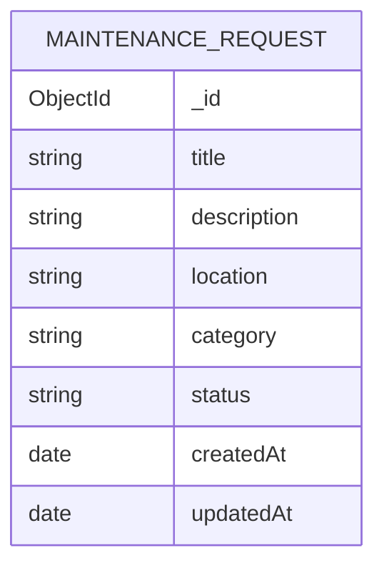

# Data Model: Campus Maintenance Requests

## MaintenanceRequest

Collection: `maintenancerequests` (Mongoose default for model `MaintenanceRequest`).

| Field         | Type        | Required | Rules                                                              | Set by          |
| ------------- | ----------- | -------- | ------------------------------------------------------------------ | --------------- |
| `_id`         | ObjectId    | yes      | generated                                                          | database        |
| `title`       | string      | yes      | non-empty, not whitespace-only                                     | client (create) |
| `description` | string      | yes      | non-empty, not whitespace-only                                     | client (create) |
| `location`    | string      | yes      | non-empty, not whitespace-only                                     | client (create) |
| `category`    | string enum | yes      | `equipment` \| `electrical` \| `plumbing` \| `facility` \| `other` | client (create) |
| `status`      | string enum | yes      | `open` \| `resolved`; default `open`                               | server only     |
| `createdAt`   | Date        | yes      | automatic (`timestamps: true`)                                     | database        |
| `updatedAt`   | Date        | yes      | automatic (`timestamps: true`)                                     | database        |

Schema options: `timestamps: true`, `versionKey: false`.

No relationships: the MVP has no users, technicians or comments.

## Validation (API input)

- **Create** (`CreateRequestDto`): exactly `title`, `description`, `location`, `category`. Any other
  property, including `status`, `_id`, `createdAt`, `updatedAt`, is rejected with 400.
- **List query** (`ListRequestsQueryDto`): optional `category`, must be one of the five categories.
- **Resolve**: path `id` must be a valid ObjectId of an existing request, otherwise 404.

## State transitions

```text
          create
  (none) ────────► open ──resolve──► resolved ──resolve──► resolved (no change)
```

- Only the resolve endpoint changes `status`, and only to `resolved`.
- There is no transition back to `open` and no deletion (out of scope).

## ER diagram


